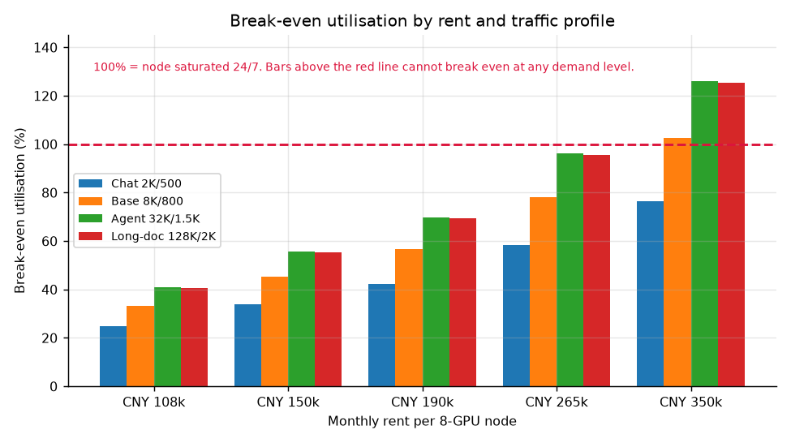
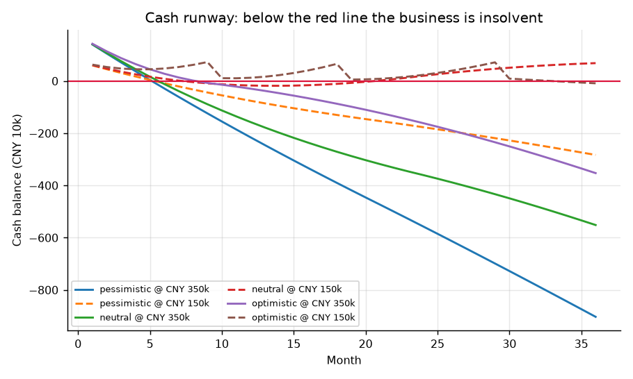
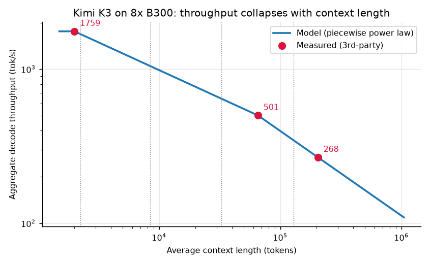
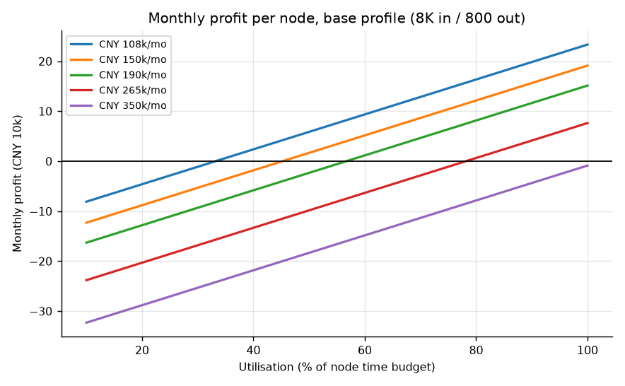
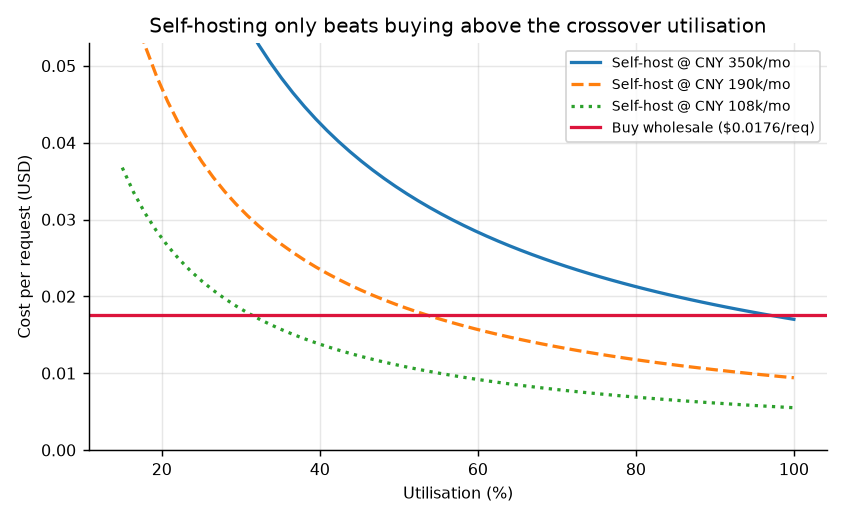

# 租用八卡 B300 自建 Kimi K3 推理并售卖 token 的投资可行性分析

**报告日期**：2026-08-05  
**分析标的**：在中国境内以 **35 万元/月** 租用一台 8 卡 NVIDIA B300 整机（含机房、电费、带宽、运维），部署开源权重模型 Kimi K3，以 API 形式售卖 token  
**测算口径**：按月支付租金、按月滚动、利润再投资复利  
**模型与数据**：[`model.py`](model.py)（可复现）、[`sources.md`](sources.md)（可查证）、[`outputs/`](outputs/)（全部产物）

---

## 零、一句话结论

**技术上完全可行，法律许可上没有障碍，但在 35 万元/月这个租金上，这笔生意在数学上不成立——即便机器 7×24 满载运行，基准流量画像下每月仍亏损约 8,754 元。建议不要按此价签约。**

同一套模型显示：把租金谈到市场长约价（10.8–15 万元/月），项目立刻转为可行，乐观需求下 19 个月回本、年化 IRR 42.8%。**决定这笔投资生死的不是技术、不是资金、不是模型选型，而是租金价格本身。**

---

## 一、结论与建议

### 1.1 三条主要结论

**结论一：35 万元/月买不到一个能赚钱的生意。**

一台八卡 B300 在基准流量画像（单请求 8K 输入 / 800 输出，85% 缓存命中）下，**满载 7×24 运行**一个月的收入上限是 **371,144 元**。扣除 5.9% 支付手续费后净留存 349,246 元，而固定成本是租金 350,000 元加杂项 8,000 元共 358,000 元。

> **盈亏平衡所需利用率 = 102.5%**（见 [`outputs/02_breakeven_by_rent.csv`](outputs/02_breakeven_by_rent.csv)）

利用率的物理上限是 100%。**平衡点高于 100%，意味着不存在任何需求水平能让这笔交易在基准画像下盈利。**

四类流量画像中，只有「短对话」（2K 输入/500 输出）一种能在 35 万租金下理论上盈利，代价是需要 **76.4% 的持续满载率**——即全年无休、日夜不间断地保持在接近满并发的状态。



**结论二：35 万元高于市场上能查到的每一个公开报价。**

| 租金档位 | 月租金 | 基准画像盈亏平衡利用率 | 满载月利润 |
| --- | ---: | ---: | ---: |
| 3 年长协（星宇智算） | 108,000 | 33.2% | +233,246 |
| 长单（雪球产业调研） | 150,000 | 45.2% | +191,246 |
| 现货中位（至顶网报道） | 190,000 | 56.7% | +151,246 |
| 现货高配（悍铭数据中心） | 265,000 | 78.2% | +76,246 |
| **本项目给定** | **350,000** | **102.5%** | **−8,754** |

数据来源见 [S-10](sources.md#s-10-国内-b300-八卡整机租金多源)。35 万元是现货报价中位数 19 万的 **1.84 倍**，是 3 年长协 10.8 万的 **3.24 倍**。

**议价空间就是本项目最大的价值来源。** 把租金从 35 万谈到 19 万，满载月利润从 −8,754 元变成 +151,246 元；谈到 15 万，变成 +191,246 元。谈判每降 1 万元租金，每月直接增加 1 万元利润，一年就是 12 万——**没有任何技术优化能比这条更有效**。

**结论三：真正的约束是需求，不是资金。**

按月付租意味着这是经营性租赁而非购置，占用资金只有押金与运营缓冲（35 万档为 175 万元，15 万档为 75 万元），资本开支极小。但这同时意味着**经营杠杆极高**：固定成本每月照付，收入却取决于能否把 token 卖出去。

36 个月滚动测算（[`outputs/07_roll_summary.csv`](outputs/07_roll_summary.csv)）显示，**在 35 万租金下，悲观、中性、乐观三种需求情景全部现金断流**：

| 情景 | 租金 | 现金转负月份 | 需追加资金 | 36 个月累计损益 | 期末节点数 |
| --- | --- | ---: | ---: | ---: | ---: |
| 悲观 | 35 万 | 第 6 月 | 9,030,619 | −10,780,620 | 1 |
| 中性 | 35 万 | 第 6 月 | 5,515,249 | −7,265,249 | 1 |
| 乐观 | 35 万 | 第 9 月 | 3,526,864 | −5,276,864 | 1 |
| 悲观 | 15 万 | 第 6 月 | 2,830,619 | −3,580,619 | 1 |
| 中性 | 15 万 | 第 8 月 | 182,850 | −65,249 | 1 |
| **乐观** | **15 万** | 第 33 月 | 87,184 | **+1,412,816** | **4** |



**六种组合里只有一种赚钱：市场长约价 + 乐观需求。** 该情景下年化 IRR 42.8%、MOIC 2.88 倍、19 个月回本、36 个月末扩到 4 台节点——这是一门好生意。但它成立的前提是租金 15 万而非 35 万。

### 1.2 建议

按优先级排列，每条都可执行、可检验：

1. **不要按 35 万元/月签约。** 拿本报告第 1.1 节的市场报价表去谈判，目标价 15 万元/月（长约）或 19 万元/月（短约）。若对方坚持 35 万，直接放弃——这不是判断，是算术。
2. **签约前先用现有转售通道验证真实需求。** 本项目已有 TokShop 在售 token，可零成本取得连续 30 天的实际消耗曲线。自建的盈亏平衡量是**每月 298.8 万次请求（约 23.9 亿输出 token）**；在实际消耗达到该量的 60% 之前，自建一定不如直接采购（见第五节）。
3. **优先争取短租或按量计费做实测。** 冷启动约 89 分钟、长上下文吞吐衰减 3.5 倍这两条，都需要用真实业务流量而非随机数据复测。第三方基准发布于 K3 开源后 9 天内，时效性有限。
4. **若谈成 15 万并决定推进，按 75 万元备资，另备 20 万元应急。** 中性情景下第 8 个月现金会短暂转负约 18 万元，这是必须提前准备而不是临时凑的钱。
5. **法律风险由你决定是否承担，本报告不代做这个价值判断。** 第九节把风险量化到现金流，但「是否接受灰色渠道硬件」属于经营者的价值选择。

---

## 二、本报告的可检验性

本报告不要求读者相信任何未经标注的数字。

- **每个外部事实**都登记在 [`sources.md`](sources.md)，含原文摘录、链接与访问日期，编号为 S-01 至 S-12；矛盾来源与取舍理由单列在该文件末尾。
- **每个计算结果**都由 [`model.py`](model.py) 生成并写入 [`outputs/`](outputs/)，正文数字可逐一回溯到 CSV。
- **模型自身可被证伪**：`python model.py --selftest` 运行 17 项检查，包括显存约束、访存物理上界、插值在标定点的复现性、盈亏平衡与利润的一致性、crossover 与平衡点的解析关系、IRR 求解器的对照检验。任何一项失败则脚本以非零码退出。

- **「每个数字可回溯」这句话本身也可执行**：[`verify.py`](verify.py) 把报告正文里的 34 处数字逐一与 `outputs/` 的产物比对，并检查报告是否残留占位符、引用的产物文件是否真实存在。不通过则退出码非零。

复算方式：

```bash
pip install -r requirements.txt
python model.py --selftest   # 17 项模型自检
python model.py              # 自检 + 重新生成全部 outputs/
python verify.py             # 34 项报告数字回溯核对
```

**已知无法查证的输入**（利用率爬坡、中断危险率、押金月数、价格侵蚀率）全部集中在 `sources.md` 末节，明确标记为假设，并在模型中做了敏感性分析。它们是推测，不是事实，报告中不据此做绝对断言。

---

## 三、事实基座（摘要）

完整版见 [`sources.md`](sources.md)。此处只列决定结论的六条。

| 编号 | 事实 | 为什么决定结论 |
| --- | --- | --- |
| S-01 | Kimi K3：2.8T 总参 / 104B 激活 / **MXFP4 量化感知训练** | MXFP4 是原生训练格式而非事后压缩，是单机装下 2.8T 模型的前提 |
| S-03 | Kimi K3 License：免费商用，仅当**经营 MaaS 且集团 12 个月收入超 2000 万美元**时需另签协议 | 本项目远低于门槛，**转售 K3 token 合法且免费**，不构成障碍 |
| S-05 | 实测权重 1.57 TB，八卡可用显存 2.30 TB；冷启动 88.8 分钟 | 装得下，但重启代价极高 |
| S-06/07 | 实测吞吐：短上下文 1,759 tok/s，64K 降至 501，200K 降至 268 | **吞吐随上下文衰减 3.5–6.6 倍**，是收入模型的核心 |
| S-10 | 国内八卡整机租金观测区间 10.8 万–26.5 万元/月 | 35 万高于全部公开报价 |
| S-12 | 汇率 1 USD = **6.7917** CNY（2026-08-04 中间价） | 收入以美元计、成本以人民币计；用惯例的 7.1 会高估人民币收入 4.5% |

> **关于时效性的如实声明**：K3 开放权重于 2026-07-27，距本报告仅 9 天。所有第三方吞吐实测都产生于 day-0 至 day-9 之间，推理引擎（vLLM / SGLang）仍在快速迭代，吞吐数据未来可能显著改善。本报告采用当下可查证的实测值，不对未来优化幅度做假设。

---

## 四、技术可行性：单机能不能跑，能跑多快

### 4.1 装得下

| 项 | 数值 |
| --- | ---: |
| K3 MXFP4 权重（实测） | 1.57 TB（195.86 GB × 8 卡） |
| 八卡可用显存（实测可见） | 2.2994 TB（267.69 GiB × 8） |
| 余量 | 0.73 TB，用于 KV 缓存、KDA 状态与激活 |

**结论：单台八卡 B300 可运行满血 Kimi K3，无需多机。** 这一条在 2025 年还不成立——是 MXFP4 量化感知训练与 288GB HBM3e 两项同时到位才使之可能。

注意可用显存取的是实测 267.69 GiB 而非标称 288 GB。用标称值会高估 7%。

### 4.2 跑多快：三个实测点与一条物理上界



模型不做线性外推，而是用三组第三方实测点标定，点之间按**分段幂律**插值。选幂律而非线性，一是物理上更贴切（上下文越长，解码越被 KV 读取主导，吞吐趋近与上下文成反比），二是更保守（基准画像处给出 1,049 tok/s，而线性插值会给出 1,242 tok/s）。

**物理上界交叉校验**：八卡聚合带宽 8 TB/s × 8 = 64 TB/s，每个解码步至少要把 1.57 TB 权重完整读一遍，故上界为 64 ÷ 1.57 × 64（batch）= **2,609 tok/s**。实测 1,759 tok/s 为上界的 **67.4%**——量级自洽，实测可信。这条校验写进了自检，若有人把参数改到突破物理上界，脚本会直接报错。

**预填速率由端到端耗时反解**：GPUStack 的两组数据可独立反解出预填速率 16,134 tok/s（64K 组）与 18,425 tok/s（200K 组），互相印证，取较低者。该速率对应算力利用率 MFU 仅 2.8%，偏低但符合 MoE 长上下文预填的特征（专家全互联通信开销大）。

### 4.3 一个必须讲清的事实：吞吐不是一个数

从 2K 上下文到 200K 上下文，聚合解码吞吐从 1,759 tok/s 掉到 268 tok/s，**衰减 6.6 倍**。任何用峰值吞吐乘以时间来估算收入的算法，都会把收入高估数倍。这是本报告与常见「算力租赁投资测算」最大的分歧点。

---

## 五、单机产能与收入

### 5.1 时间预算模型

节点的每一秒被预填与解码瓜分：

```
1 秒 = 每秒请求数 × ( 未命中输入 / 预填速率 + 输出 token / 聚合解码速率 )
```

解出每秒请求数，即为该流量画像下的满载产能。**不采用「输出收入 + 输入收入」的简单相加**——那会把同一台机器的时间算两遍。

### 5.2 四类画像的满载产能

来源：[`outputs/01_capacity_by_profile.csv`](outputs/01_capacity_by_profile.csv)

| 画像 | 平均上下文 | 解码吞吐 | 月请求数 | 单请求收入 | 满载月收入 | 解码占用时间比 |
| --- | ---: | ---: | ---: | ---: | ---: | ---: |
| 对话 2K/500 | 2,250 | 1,686 tok/s | 822.5 万 | $0.00891 | ¥497,698 | 94.1% |
| **基准 8K/800** | 8,400 | 1,049 tok/s | 309.8 万 | $0.01764 | **¥371,144** | 91.1% |
| 智能体 32K/1500 | 32,750 | 643 tok/s | 98.6 万 | $0.04506 | ¥301,610 | 88.7% |
| 长文档 128K/2000 | 129,000 | 345 tok/s | 37.1 万 | $0.12024 | ¥303,254 | 83.0% |

两点值得注意：

1. **解码占用了 83%–94% 的机器时间**，预填只占零头。这意味着**输出 token 才是产能的真正消耗者**，也是定价的真正标的。
2. **长上下文画像的满载收入反而更低。** 单请求收入涨了 6.8 倍（$0.0176 → $0.1202），但请求数掉了 8.3 倍，净效应是收入下降。**卖长上下文不赚钱**——这与直觉相反，是本模型最有价值的发现之一。

### 5.3 缓存命中率：一个容易被忽略的隐藏变量

OpenRouter 实测显示，K3 各家 provider 的缓存命中率在 **65%–89%** 之间，Moonshot 自营达 89.3%，导致**有效输入价仅 $0.588/M，是标价 $3.00/M 的 19.6%**（[S-09](sources.md#s-09-缓存命中率与有效输入价决定收入的隐藏变量)）。

本模型取 85% 命中率。若误用标价 $3.00/M 计算输入收入，基准画像的单请求收入会从 $0.01764 虚高到 $0.036，**收入高估一倍以上**。这是同类测算最常见的错误。

### 5.4 盈亏平衡



35 万租金下，基准画像的月利润随利用率变化（[`outputs/03_profit_grid.csv`](outputs/03_profit_grid.csv)）：

| 利用率 | 月收入 | 月利润 |
| ---: | ---: | ---: |
| 50% | ¥185,572 | **−¥183,377** |
| 60% | ¥222,686 | −¥148,452 |
| 80% | ¥296,915 | −¥78,603 |
| 100%（满载） | ¥371,144 | **−¥8,754** |

**整条曲线都在零线以下。**

---

## 六、自建还是采购：crossover 判据

这是本报告决策价值最高的一节。

自建的本质是**把可变成本变成固定成本**。租金每月照付，与卖出多少 token 无关；采购则是卖多少买多少。因此只有产量足够大时，摊薄后的固定成本才低于按量采购。



来源：[`outputs/05_unit_cost.csv`](outputs/05_unit_cost.csv)、[`outputs/04_crossover.csv`](outputs/04_crossover.csv)

| 利用率 | 月请求数 | 自建单请求成本 | 采购单请求成本 | 自建是否更便宜 |
| ---: | ---: | ---: | ---: | --- |
| 20% | 62.0 万 | $0.0851 | $0.01764 | 否，贵 382% |
| 40% | 123.9 万 | $0.0425 | $0.01764 | 否，贵 141% |
| 60% | 185.9 万 | $0.0284 | $0.01764 | 否，贵 61% |
| 80% | 247.8 万 | $0.0213 | $0.01764 | 否，贵 21% |
| 100% | 309.8 万 | $0.0170 | $0.01764 | 是，**仅省 3.5%** |

**crossover 点：每月 298.8 万次请求，约 23.9 亿输出 token。** 达到该量之前，自建一定比直接向上游采购更贵。

即便完全达到满载，自建相对采购也**只省 3.5%**。为了 3.5% 的成本优势，去承担 175 万元的资金占用、灰色渠道硬件的法律风险、89 分钟冷启动的运维负担和 7×24 满载的运营压力——**这个交换在 35 万租金下显然不划算**。

对照：同样的 crossover 计算在 15 万租金下只需要 128 万次请求/月，满载可省 55%。**同一个商业模式，在两个租金价位上是两门完全不同的生意。**

---

## 七、月度滚动与复利

### 7.1 模型规则

- **初始投入** = 押金（2 个月租金）+ 运营现金缓冲（3 个月租金）。不含首月租金——租金已在损益中逐月计提，再计入占用资金会重复计算。
- **再投资**：现金足以覆盖新节点启动资金，**且**需求已逼近现有产能 90% 时，才增开一台。两个条件缺一不可——只满足资金条件就扩张，等于白付租金。
- **价格侵蚀**：年化 20%（假设，见 sources.md）。理由是 K3 开源仅 9 天已有 11 家 provider 同价竞争，新进入者是纯价格接受者。
- **中断危险率**：月度 1.5%（假设），用于计算风险调整后的期望损益。

### 7.2 结果

完整逐月表见 [`outputs/06_roll_*.csv`](outputs/)，汇总见 [`outputs/07_roll_summary.csv`](outputs/07_roll_summary.csv)。结论已在第 1.1 节给出：**35 万租金下三情景全灭，15 万租金下仅乐观情景成立**。

唯一可行组合（乐观需求 + 15 万租金）的关键月份：

| 月份 | 节点数 | 利用率 | 月收入 | 月利润 | 期末现金 |
| ---: | ---: | ---: | ---: | ---: | ---: |
| 1 | 1 | 10% | ¥36,431 | −¥123,719 | ¥626,281 |
| 6 | 1 | 60% | ¥199,177 | +¥29,425 | ¥478,899 |
| 12 | 2 | 60% | ¥356,298 | +¥19,277 | ¥124,560 |
| 18 | 2 | 90% | ¥478,024 | +¥133,821 | ¥655,933 |
| 24 | 3 | 80% | ¥570,077 | +¥62,443 | ¥234,422 |
| 30 | 3 | 100% | ¥637,366 | +¥125,761 | ¥91,003 |
| 36 | 4 | 84% | ¥641,999 | −¥27,878 | −¥87,184 |

投资指标：**年化 IRR 42.8%，MOIC 2.88 倍，回本期 19 个月**。

但要如实指出该情景的两个脆弱处：

1. **现金曲线呈锯齿状且多次逼近零**（第 12、19、30、36 月）。每开一台新节点吃掉 75 万元现金，扩张节奏稍快就会断流。第 36 月现金转负 87,184 元，就是扩到第 4 台节点的代价。
2. **它依赖「乐观」需求假设**——10 个月内吃满第一台节点、长期需求达 3 台节点当量。这个假设没有外部依据，取决于项目方自身获客能力，属于**待验证项而非已知事实**。

### 7.3 资金使用效率

因为是经营性租赁，占用资金的分母很小，这会让收益率的绝对值显得很高。必须同时看两个数才不失真：

| 指标 | 乐观 + 15 万 | 中性 + 15 万 | 乐观 + 35 万 |
| --- | ---: | ---: | ---: |
| 初始占用资金 | ¥750,000 | ¥750,000 | ¥1,750,000 |
| 36 个月累计损益 | +¥1,412,816 | −¥65,249 | −¥5,276,864 |
| 月均 ROIC | +2.50% | −0.24% | −8.38% |
| 期末权益 / 初始投入 | 2.88× | 0.91× | −2.02× |
| 风险调整后累计损益（h=1.5%/月） | +¥1,027,486 | −¥277,730 | −¥4,097,704 |

**高经营杠杆是双向的**：分母小让好情景的 ROIC 很漂亮（月均 2.5%），也让坏情景的亏损相对本金放大得极快（月均 −8.4%）。这不是一个「大不了不赚钱」的生意，而是一个**亏起来能亏掉数倍本金**的生意。

---

## 八、风险量化

### 8.1 断供与法律风险

**事实**：B300 对华维持出口管制推定拒绝，境内可租到的必然来自非官方渠道。英伟达公开声明「**不对此类系统提供任何服务或支持**」，且 2026 年 3 月对 Supermicro 联合创始人的起诉后，现货价从约 400 万元涨到约 700 万元（[S-11](sources.md#s-11-出口管制与灰色渠道现状)）。

**在中国境内租用算力本身不违反中国法律**，出口管制的违反者是把硬件运进来的一方。但承租方需如实认知三项后果：

1. 无保修、无官方驱动与固件支持，故障即停机；
2. 供应链受查处影响，服务可能中断；
3. BIS 2026-05 指引明确，中国总部实体即使在新加坡等第三国接收也需许可证——**「换到境外租」不是规避路径**。

**量化**（[`outputs/08_survival.csv`](outputs/08_survival.csv)）：以月度中断危险率 h 做生存分析。

| h（月） | 期望存续 | 36 个月存活概率 | 乐观情景 36 月名义损益 | 风险调整后 |
| ---: | ---: | ---: | ---: | ---: |
| 0.5% | 200 月 | 83.5% | −¥5,276,864 | −¥4,835,472 |
| 1.5% | 66.7 月 | 58.0% | −¥5,276,864 | −¥4,097,704 |
| 3.0% | 33.3 月 | 33.4% | −¥5,276,864 | −¥3,270,943 |

注意一个反直觉但正确的现象：**在亏损情景下，中断风险越高，期望损失反而越小**——因为早点停业等于早点止损。这恰恰说明，当主营本身亏损时，讨论风险溢价是没有意义的，应该先解决盈利问题。

**租赁相对购置的一个真实优势**：被查处时你损失的是押金与业务连续性，而不是 700 万元的设备残值。这一点应当在谈判中作为「我方不承担残值风险，故不应支付含残值溢价的租金」的依据。

### 8.2 预付余额退款负债（与主业耦合）

TokShop 售卖的是**预付额度**，且 [`src/lib/legal.ts`](../../src/lib/legal.ts) 的退款政策承诺「未消费余额 14 天内可退」「服务中断属我方故障」。这意味着：

**服务一旦中断，未消费的客户余额构成真实的偿付义务，且发生在你现金最紧张的时刻。** 规模越大，这项或有负债越大。建议在扩张前明确：预留相当于未消费余额 100% 的隔离资金，或在条款中把「不可抗力导致的服务终止」与退款义务的关系写清楚（当前条款未区分）。

### 8.3 价格战

K3 开源 9 天内已有 11 家 provider 以几乎相同价格供应同一模型（[S-08](sources.md#s-08-k3-官方与市场售价)），其中不乏 Fireworks、Together、Baseten 等具备规模与延迟优势的厂商。新进入者**没有定价权**，只能接受市场价并承受持续下行。模型中按年化 20% 侵蚀计入，属中性假设，无历史序列可拟合。

---

## 九、自动化与无人化的真实边界

按项目要求，全流程应由软件与 AI 完成、无全职人力。如实划线：

**可以做到无人化**（本仓库已实现或可直接复用）：

- 推理服务与弹性扩缩、健康检查、异常熔断
- 计费与对账：按 token 精确计量、原子结算、双层幂等（已实现）
- 支付与交付：两条支付通道、游客结账、自动开通（已实现）
- 获客：SEO/GEO 内容引擎，含事实核查质检（已实现，日均自动发文）
- 余额闸门：余额为零自动拒服务，绝不产生坏账（已实现）

**做不到无人化，必须由人承担**：

- 与 IDC 的签约、续约与议价
- 支付通道的实名 KYC 与合规审核
- 硬件故障时的现场介入与升级路径（英伟达不提供支持，只能依赖 IDC）
- 许可证阈值的合规复核（收入接近 2000 万美元时需主动与 Moonshot 签约）
- 税务申报

**一条必须正视的工程约束**：冷启动约 89 分钟。这意味着节点重启的代价是近一个半小时的完全不可用。软件侧可以用蓝绿部署与预热副本规避计划内重启，但**无法消除非计划宕机的影响**——而一台节点的架构里没有冗余副本可切。若要做到真正的高可用，最少需要两台节点，固定成本翻倍，盈亏平衡利用率也随之翻倍。**「单机 + 无人化 + 高可用」这三者在当前成本结构下不可兼得。**

---

## 十、分阶段目标与 go/no-go 判据

不给「建议投资」或「不建议投资」的空泛结论，给可检验的门槛。

### 阶段 0：零成本验证需求（现在就做）

- **动作**：用现有 TokShop 转售通道接入 K3（向上游按量采购），正常售卖。
- **产出**：连续 30 天的真实 token 消耗曲线、请求画像分布（输入/输出长度、缓存命中率）。
- **判据**：月输出 token 消耗 ≥ **23.9 亿**（crossover 的 100%）→ 进入阶段 1；≥ 14.3 亿（60%）→ 可开始谈判但不签约；低于此 → **停止，继续转售**。
- **为什么**：这一步不花一分钱，却能一次性验证需求、画像和缓存率三个模型中最不确定的输入。

### 阶段 1：议价（判据达标后）

- **动作**：以本报告的市场报价表议价，目标 ≤ 19 万元/月（短约）或 ≤ 15 万元/月（长约）。
- **判据**：谈成 ≤ 19 万 → 进入阶段 2；谈不下来 → **停止**。
- **退出机制**：本阶段无沉没成本，随时可退。

### 阶段 2：短租实测（不超过 1 个月）

- **动作**：按量或月付短租一台，用**真实业务流量**复测吞吐、冷启动、故障率。
- **判据**：实测满载聚合吞吐 ≥ 建模值的 80%（即基准画像 ≥ 840 tok/s）→ 进入阶段 3；显著低于 → 重估模型后再决策。
- **为什么**：第三方基准用的是随机数据且发布于开源后 9 天内，必须用自己的流量复核。

### 阶段 3：签约与滚动扩张

- **动作**：签长约，备足 75 万元本金 + 20 万元应急。
- **扩张判据**：现有节点利用率连续 2 个月 ≥ 90%，**且**现金 ≥ 一台节点启动资金 + 3 个月缓冲，才增开下一台。
- **退出机制**：连续 3 个月利用率 < 盈亏平衡点，启动退租；预留未消费客户余额 100% 的隔离资金以履行退款义务。

---

## 十一、局限与自我批评

主动列出本报告最可能出错的地方，供任何人攻击。

1. **吞吐数据的时效性最弱。** 三组实测都产生于 K3 开源后 9 天内，推理引擎在快速迭代，未来吞吐大概率改善。若吞吐提升 50%，35 万租金下的基准盈亏平衡点将从 102.5% 降到约 68%——**结论会从「不可能」变成「很难」，但仍不推荐**。
2. **短上下文标定点的并发数与长上下文点不一致**（c=64 vs c=10），两者混合使用会把「并发效应」与「上下文效应」部分混淆。已在 sources.md 的 C-5 记录。方向上偏保守。
3. **利用率爬坡曲线纯属假设。** 这是模型中唯一完全没有外部依据的输入，也恰恰是结果最敏感的输入。阶段 0 的作用就是用真实数据替换它。
4. **未建模的收入可能性**：批发给中转商、私有化部署、微调服务等可能带来高于零售 API 的单价。本报告只测算了「零售售卖 token」这一种模式，未穷尽商业模式空间。
5. **未建模的成本项**：客服人力、坏账、法务、税费均未计入，实际成本只会更高，不会更低。
6. **汇率按静态 6.7917 处理**，未建模波动。人民币若继续升值，结论更不利；贬值则相反。

---

## 附录 A：产物清单

| 文件 | 内容 |
| --- | --- |
| [`outputs/01_capacity_by_profile.csv`](outputs/01_capacity_by_profile.csv) | 四类画像的产能、单请求收入、满载收入、盈亏平衡利用率 |
| [`outputs/02_breakeven_by_rent.csv`](outputs/02_breakeven_by_rent.csv) | 租金五档 × 画像四类的盈亏平衡利用率矩阵 |
| [`outputs/03_profit_grid.csv`](outputs/03_profit_grid.csv) | 利用率 10%–100% × 租金五档的月收入与月利润 |
| [`outputs/04_crossover.csv`](outputs/04_crossover.csv) | 各画像下自建追平采购所需的月请求量与 token 量 |
| [`outputs/05_unit_cost.csv`](outputs/05_unit_cost.csv) | 自建 vs 采购的单请求成本对比 |
| [`outputs/06_roll_*.csv`](outputs/) | 六种情景 × 租金组合的 36 个月逐月现金流 |
| [`outputs/07_roll_summary.csv`](outputs/07_roll_summary.csv) | 滚动复利汇总：IRR、MOIC、回本期、ROIC、偿付能力 |
| [`outputs/08_survival.csv`](outputs/08_survival.csv) | 三档中断危险率下的生存分析与风险调整损益 |
| [`outputs/facts.json`](outputs/facts.json) | 报告正文引用的关键数字快照 |
| `outputs/fig1..fig5.png` | 五张图 |

## 附录 B：模型参数一览

外生事实（可回溯 sources.md）与显式假设分列，便于第三方替换参数重算。

| 类别 | 参数 | 取值 | 出处 |
| --- | --- | ---: | --- |
| 事实 | K3 权重（MXFP4） | 1.57 TB | S-05 |
| 事实 | 单卡可用显存 | 267.69 GiB | S-04 实测 |
| 事实 | B300 HBM 带宽 | 8 TB/s | S-04 |
| 事实 | 短上下文吞吐 | 1,759 tok/s @ c=64 | S-06 |
| 事实 | 64K / 200K 吞吐 | 501 / 268 tok/s | S-07 |
| 事实 | 预填速率（反解） | 16,134 tok/s | S-07 推导 |
| 事实 | 售价 | $3.00 / $0.30 / $15.00 每 M | S-08 |
| 事实 | 汇率 | 6.7917 | S-12 |
| 假设 | 缓存命中率 | 85% | S-09 区间中位 |
| 假设 | 押金 + 缓冲 | 2 + 3 个月租金 | 无合同文本 |
| 假设 | 支付费率 | 3.9% + $0.40/笔 | 本仓 PAYMENTS_SETUP.md |
| 假设 | 价格侵蚀 | 年化 20% | 定性推断 |
| 假设 | 中断危险率 | 0.5% / 1.5% / 3.0% 每月 | 无公开统计 |
| 假设 | 需求爬坡 | 三情景 | 取决于项目方获客能力 |

---

*本报告由模型自动生成数字、人工组织论证。所有结论可复算、可反驳。发现错误请直接以 `model.py` 复现并指出，我们会修正而非辩解。*
