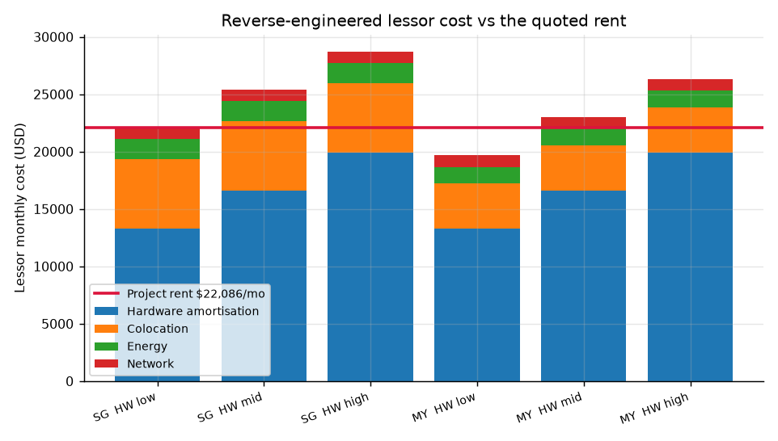
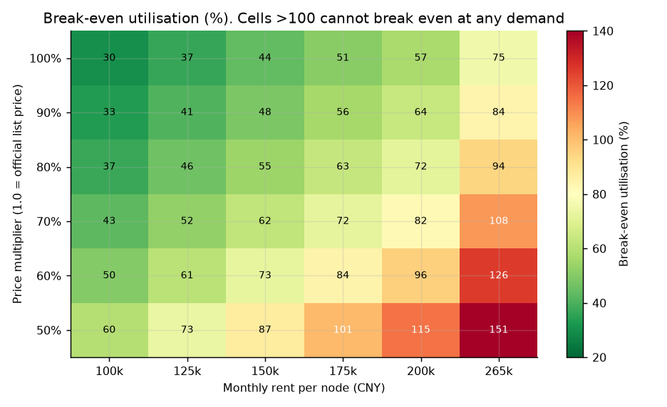
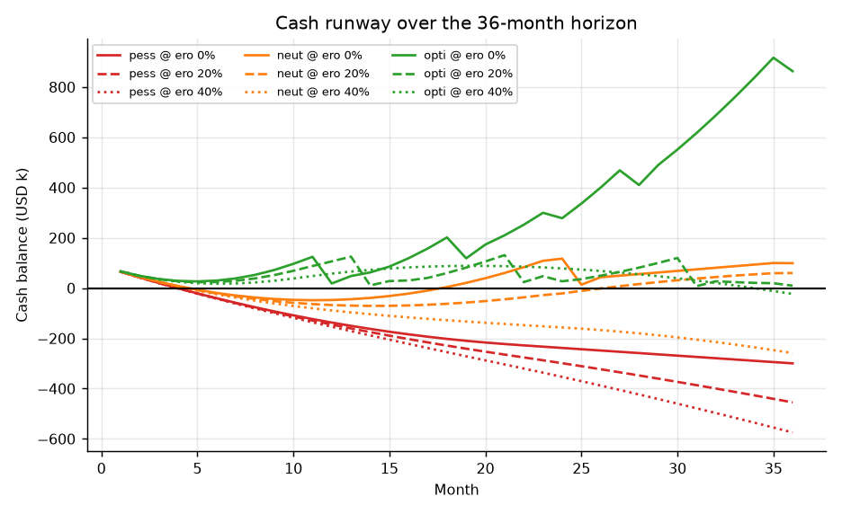
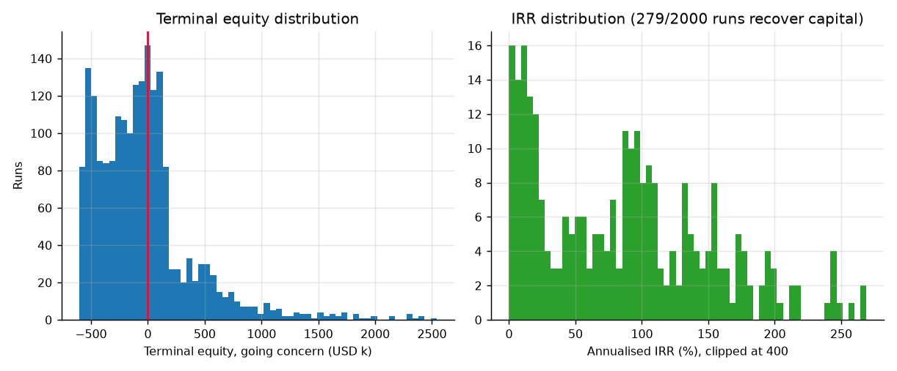
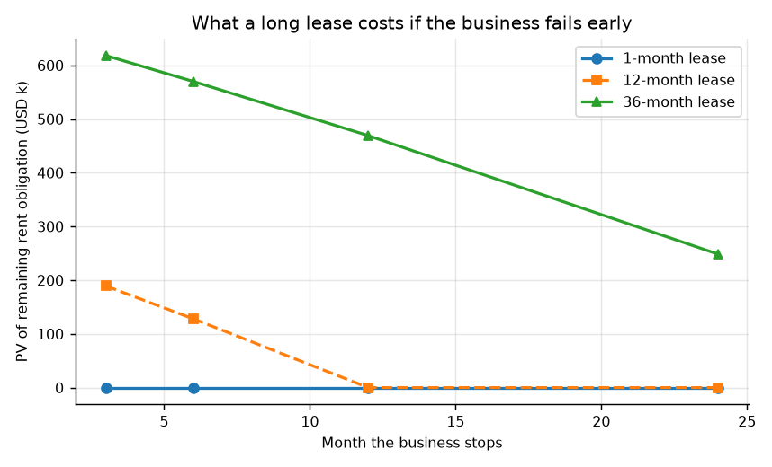
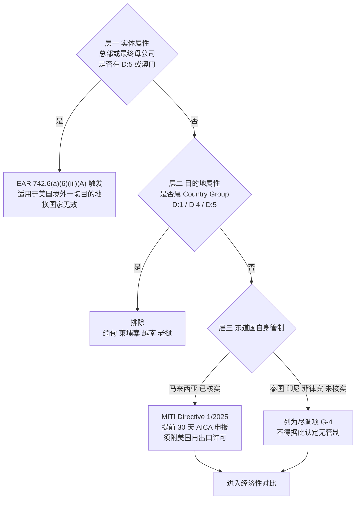
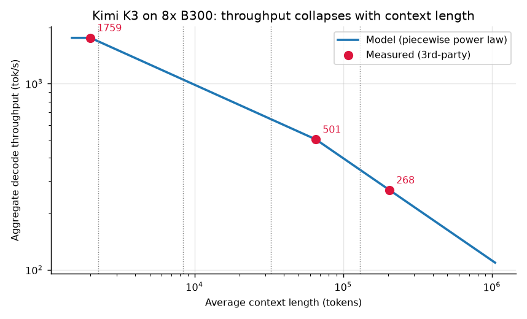

# 东南亚租赁八卡 B300 自建 Kimi K3 推理并售卖 token 的投资可行性分析

**报告日期**：2026-08-05
**分析标的**：在东南亚不受美国 GPU 出口管制的国家，以 **15 万元人民币/月** 租用一台 8 卡 NVIDIA B300 整机，部署开放权重模型 Kimi K3，通过自建 API 与 OpenRouter 双轨售卖 token
**测算口径**：按月支付租金、按月滚动、利润复利再投资，36 个月窗口 + 租约清算期
**模型与数据**：[`model/`](model/)（可复现）、[`02-数据来源与核验附录.md`](02-数据来源与核验附录.md)（可查证）、[`outputs/`](outputs/)（全部产物）
**姊妹报告**：[`../b300-kimi-k3/报告.md`](../b300-kimi-k3/报告.md) 分析同一模式在中国境内 35 万元/月 的情形，两份互为对照

---

## 零、一句话结论

**技术上完全可行，单位经济性也成立（基准画像盈亏平衡利用率 43.6%），但这不是一笔可以按常规方式推进的生意——它的风险结构极不对称：上行有限（2,000 次蒙特卡洛中位终值为 −9.2 万美元），下行极大（36 个月租约若在第 6 个月失败，剩余义务现值 57.0 万美元，是初始资金 13.3 万美元的 4.3 倍）。**

而且**选址解决不了最关键的那个问题**。美国的管制分两层，其中实体属性那一层适用于"美国境外的一切目的地"，换国家无效。

---

## 一、结论与建议

### 1.1 五条主要结论

**结论一：东南亚"不受管制的国家"，答案与直觉相反。**

3A090 类先进算力物项对 Country Group D:1/D:4/D:5 目的地本身有许可要求。东南亚各国的实际归属是：缅甸仍在 D:5；柬埔寨 2026-02-03 已移出 D:5 但**仍在 D:1**；**越南与老挝也在 D:1**。所以在目的地层面被排除的是**柬埔寨、老挝、缅甸、越南**四国。

越南被排除这一条最值得注意：FPT AI Factory 已经上线了 HGX B300 按需云，硬件现货实实在在有，但目的地层面就卡住了。

通过筛查的是：**马来西亚、泰国、印度尼西亚、菲律宾**，加上作为成本上界对照的**新加坡**。

但更要紧的是那条换国家解决不了的：BIS 2026-05-31 指引明确许可要求适用于"all destinations outside the United States"，判定依据是终端用户的**总部与最终母公司所在地**。这一层是 Gate 0，不是选址题。

**结论二：15 万元/月 不是便宜货，是贴着地板的价。**

三条互相独立的路径指向同一结论：

| 验证路径 | 数值 | 与本项目对比 |
| --- | ---: | --- |
| 本项目给定 | $22,086/月（$3.7818/卡·小时） | 基准 |
| Bit Origin 马来西亚可比交易 | $22,500/台/月 | 我方**低 1.84%** |
| 出租方成本反推（马来西亚，硬件中位） | $22,985/月 | 我方**低于其成本 3.9%** |
| 出租方成本反推（马来西亚，硬件低位） | $19,663/月 | 出租方毛利仅 11.0% |
| 出租方成本反推（新加坡，硬件低位） | $22,076/月 | 出租方毛利 **0.04%** |

（见 [`outputs/02_rent_benchmarks.csv`](outputs/02_rent_benchmarks.csv)、[`outputs/02_lessor_cost_buildup.csv`](outputs/02_lessor_cost_buildup.csv)）

Bit Origin（NASDAQ: BTOG）自己的账更说明问题：16 台服务器 1,100 万美元，折合每台 **$687,500**，而预期月收入每台 $22,500——**硬件毛收益率仅 39.3%/年，光收回硬件成本就要 30.6 个月**，还没算托管与电费。



这改变了风险的性质。**这不是议价空间问题，是交易对手可持续性问题。** 一个以低于自身成本的价格签 36 个月长约的出租方，要么是硬件成本远低于市场（有其来源问题），要么是在赌后市，要么会在合约期内违约。**签约前必须查清对方的硬件取得成本与资金结构，这比压价重要得多。**

顺带一个反直觉的推论：**不要把精力花在压价上。** 这个价已经在地板，再压只会提高对方违约概率。谈判筹码应该全部用在**提前终止条款**上——理由见结论五。

**结论三：选址的价值比想象的小，而且不在延迟上。**

| 算力地 | 到美西 RTT | TTFT 均值 | 相对新加坡恶化 | 托管价估计 | 空置率 |
| --- | ---: | ---: | ---: | ---: | ---: |
| 新加坡 | 165 ms | 731.7 ms | — | $403/kW·月（报价） | 4.9% |
| 马来西亚 柔佛 | 180 ms | 746.7 ms | +2.05% | $261.5（估计） | **0.7%** |
| 印尼 雅加达 | 180 ms | 746.7 ms | +2.05% | $195.9（估计） | 20.5% |
| 泰国 曼谷 | 200 ms | 766.7 ms | +4.78% | $239.8（估计） | **23.3%** |
| 菲律宾 | 数据缺口 G-3 | — | — | 数据缺口 G-1 | — |

（见 [`outputs/03_siting_matrix.csv`](outputs/03_siting_matrix.csv)、[`outputs/03_latency_slo.csv`](outputs/03_latency_slo.csv)）

**迁出新加坡的延迟代价只有 2.05%–4.78%，可以忽略。** 更值得注意的是：实测 TTFT 的 P90 在新加坡就已经是 1,107 ms，**本身就超过 1 秒的 SLO 阈值**——瓶颈在模型和并发，不在选址。

真正有价值的选址结论有两条，都与成本无关而与议价能力有关：

- **柔佛电价便宜（$0.12–0.13/kWh vs 新加坡 $0.15）但空置率仅 0.7%，比新加坡（4.9%）还紧张，议价空间反而最小。**
- **曼谷（23.3%）与雅加达（20.5%）才是买方市场。**

以及一条决定"这个价在哪里可持续"的推算（[`outputs/02_lessor_cost_by_country.csv`](outputs/02_lessor_cost_by_country.csv)）：

| 算力地 | 出租方成本（硬件中位） | 15 万元/月对出租方是否可持续 |
| --- | ---: | --- |
| 印度尼西亚 | $21,999 | 是（但电价为假设值，见 G-2） |
| 泰国 | $22,658 | 否，差 2.6% |
| 马来西亚 | $22,985 | 否，差 3.9% |
| 新加坡 | $25,397 | 否，差 13.0% |

**结论四：单位经济性成立，但只在官方定价附近成立。**

一台节点在四类流量画像下的满载表现（[`outputs/04_capacity_by_profile.csv`](outputs/04_capacity_by_profile.csv)）：

| 画像 | 平均上下文 | 解码吞吐 | 满载月收入 | 每节点·小时收入 | 盈亏平衡利用率 |
| --- | ---: | ---: | ---: | ---: | ---: |
| 对话 2K/500 | 2,250 | 1,686 tok/s | $73,280 | $100.38 | **32.5%** |
| **基准 8K/800** | 8,400 | 1,049 tok/s | $54,647 | $74.86 | **43.6%** |
| 智能体 32K/1500 | 32,750 | 643 tok/s | $44,409 | $60.83 | 53.7% |
| 长文档 128K/2000 | 129,000 | 345 tok/s | $44,651 | $61.17 | 53.4% |

但价格弹性极小。基准画像下：

- 按官方价（$3.00/$0.30/$15.00）：平衡利用率 **43.6%**
- 主动折价 50%（对标 TeamoRouter 的 $1.50/$7.50）：平衡利用率 **87.3%**
- 折价超过 50%：**在 15 万租金下不存在可行解**



**这条约束很硬：K3 开放权重 9 天内已有 11 家 provider 同价竞争，新进入者没有定价权，只能接受市场价并承受下行。而模型显示我们最多只能承受 50% 的价格下行。**

**结论五：36 个月滚动下，只有一种组合成立；而且最大的风险藏在窗口之外。**

三种需求情景 × 三档价格侵蚀率的结果（[`outputs/06_roll_summary.csv`](outputs/06_roll_summary.csv)）：

| 需求情景 | 侵蚀 0% | 侵蚀 20% | 侵蚀 40% |
| --- | --- | --- | --- |
| 悲观 | 亏 $270,838 | 亏 $426,081 | 亏 $545,733 |
| 中性 | **IRR 13.3%**，赚 $776,051 | 赚 $88,574，未回本 | 亏 $229,893 |
| 乐观 | **IRR 245.5%**，赚 $2,453,828 | **IRR 90.8%**，赚 $82,374 | 赚 $5,284 |

（"赚/亏"为继续经营口径的终值，已含租约清算期的净现值）



**年化价格侵蚀率是决定生死的单一变量，而它恰恰是本模型中最没有出处的假设。** 它没有历史序列可拟合，只能靠"11 家同价竞争"的市场结构定性推断。报告不对它下断言，只把结论写成它的函数。

2,000 次蒙特卡洛（[`outputs/08_monte_carlo.csv`](outputs/08_monte_carlo.csv)）给出概率分布：

| 指标 | 数值 |
| --- | ---: |
| 继续经营终值为正的概率 | **38.4%** |
| 36 个月内回本的概率 | **14.2%** |
| IRR 分位数 P10 / P50 / P90 | 8.5% / 86.4% / 176.5% |
| 终值分位数 P10 / P50 / P90 | −$506,510 / **−$92,288** / +$492,226 |
| 最坏停摆情形 | −$1,440,557 |



**中位终值为负。** IRR 中位数看起来很漂亮（86.4%），但那只统计了"能回本"的那 14.2% 的样本——只看 IRR 不看回本概率会严重误导。

而窗口之外还有一笔：**长租约的下行不对称**（[`outputs/07_downside_asymmetry.csv`](outputs/07_downside_asymmetry.csv)）。



| 业务停摆月份 | 月付无承诺 | 12 个月租约 | 36 个月租约 |
| ---: | ---: | ---: | ---: |
| 第 3 月 | $0 | $189,187 | $618,174 |
| 第 6 月 | $0 | $127,998 | **$569,983** |
| 第 12 月 | $0 | $0 | $469,177 |
| 第 24 月 | $0 | $0 | $248,577 |

第 6 个月失败时，36 个月租约留下的剩余义务现值是 **$569,983，相当于初始资金 $132,515 的 4.3 倍**。在乐观情景下若业务停摆，停摆口径终值为 −$1,174,145。

**这是"用长约换低价"的真实代价。而低价本身（结论二）已经证明没有议价红利可拿——等于用巨大的下行风险，换了一个本来就是市价的价格。**

值得单独指出的是：**缩短租期不但不损害正常经营，还能提高价值。** 模型中租期只影响"你想停的时候还要付多久"，不影响窗口内的经营（租约到期自动续期）。中性情景下 12 个月租约的继续经营终值为 **$97,907**，高于 36 个月的 $88,574——因为窗口外的剩余义务更少（[`outputs/07_sensitivity_neutral.csv`](outputs/07_sensitivity_neutral.csv)）。**短租期是纯增益：正常经营不受影响，失败时损失小 4 倍以上。**

### 1.2 建议

按优先级排列，每条都可执行、可检验：

1. **先过 Gate 0，再谈其他。** 请出口管制律师就两件事出具书面意见：(a) 运营主体及其最终母公司总部所在地是否落入 D:5/澳门；(b) 独占式裸金属租赁是否构成 EAR 意义上的 transfer (in-country)。第一件不过，后面全部作废，且换国家无效。

2. **把全部谈判筹码押在提前终止条款上，而不是价格上。** 价格已经在地板（结论二），继续压价只会提高对方违约概率。而把 36 个月改成"12 个月 + 可续"或"36 个月带 90 天无责终止"，能把第 6 月失败的损失从 $569,983 压到 $127,998 甚至 $0——**这一条的价值远超任何降价**。

3. **签约前做交易对手尽调。** 具体查三件事：对方的 B300 取得成本与来源、是否持有必要的美国再出口授权、以及是否有其他已投运客户。Bit Origin 的公开数据显示这个价位下出租方自己也很紧，对方的偿付能力是我方的实质风险。

4. **优先谈泰国与印尼，不是柔佛。** 柔佛空置率 0.7%，你没有议价空间；曼谷 23.3%、雅加达 20.5% 才有。泰国另有 Freyr AI 这样已把 B300/GB300 投入实际运营的可指名交易对手，且企业所得税 20% 低于马来西亚 24%。

5. **买算力即服务，不要租裸金属。** 同一个决定同时缓释两个风险：出口管制上的 transfer 定性风险，与东道国的服务器常设机构风险。两者判定的都是"你是否支配该物项"，所以指向同一个答案。

6. **主体注册在新加坡，算力放在低成本国。** 新加坡 17% 标准税率叠加新创减免后，30 万美元利润的首年有效税率仅 **5.74%**，第 4 年 12.47%，均低于泰国 20%、马来西亚 24%、菲律宾 25%（[`outputs/03_structure_tax.csv`](outputs/03_structure_tax.csv)）。放进 36 期滚动模型，分离结构相对注册在当地**值 $21,942（泰国）到 $27,519（马来西亚）**，相当于初始资金的 17%–21%。

7. **在需求被验证之前不要签长约。** 蒙特卡洛显示 36 个月内回本概率仅 14.2%，而决定成败的"需求能否在 10 个月内吃满第一台"完全没有外部依据。先用现有转售通道跑 30 天真实流量（阶段 0），成本为零。

---

## 二、本报告的可检验性

本报告不要求读者相信任何未经标注的数字。

- **每个外部事实**登记在 [`02-数据来源与核验附录.md`](02-数据来源与核验附录.md)，含原文摘录、链接与访问日期，编号 S-01 至 S-33；矛盾来源与取舍理由单列。
- **每个参数**集中在 [`model/params.yaml`](model/params.yaml)，带 `src`、`date` 与不确定度。代码中不出现裸字面量常数。
- **每个计算结果**由 [`model/`](model/) 生成并写入 [`outputs/`](outputs/)，正文数字可逐一回溯到 CSV 或 `facts.json`。
- **模型自身可被证伪**：`python model/test_model.py` 运行 **55 项检查**，覆盖显存约束、访存物理上界、专家覆盖率自洽、插值在标定点的复现性、盈亏平衡与 crossover 的解析关系、会计恒等式、清算期归零、IRR 求解器对照。任何一项失败即以非零码退出。
- **"每个数字可回溯"这句话本身也可执行**：[`verify.py`](verify.py) 把正文里的数字逐一与 `outputs/` 比对，并检查残留占位符与失效引用。

复算方式：

```bash
cd reports/sea-b300-kimi-k3
pip install -r requirements.txt
python model/test_model.py     # 55 项模型自检
python model/run_all.py        # 自检 + 重新生成全部 outputs/
python verify.py               # 报告数字回溯核对
```

**已知无法查证的输入**（价格侵蚀率、利用率爬坡、中断危险率、押金与租期、各国托管实际报价）全部集中在 `params.yaml` 的 `assumptions` 与 `gaps` 段，明确标记为假设或缺口，并全部纳入敏感性分析。它们是推测，不是事实。

---

## 三、Gate 0：三层管制筛查

把"美国对 GPU 的管制"当成一个整体，是选址分析最常见的错误。它至少是三套独立规则，触发条件不同、能否用选址规避也不同。



### 3.1 层一：实体属性（换国家无效）

[BIS 2026-05-31 指引](https://media.bis.gov/media/documents/bis-guidance-may-31-2026.pdf) 原文：许可要求适用于 "**all destinations outside the United States**"，触发条件是实体**总部或其最终母公司总部**位于 Country Group D:5 或澳门。Greenberg Traurig 的解读点得更直白：无论接收方在新加坡、阿联酋还是马来西亚，一样适用。

指引同时留了一条：善意数据中心运营商对**存量**物项的持续使用、存储、处置、维护，在 BIS 另行通知前无需停止。这条对新增部署不适用。

**本报告不替用户假设主体结构。** 模型中该项返回 `undetermined`，两个分支并列呈现（[`model/compliance_screen.py`](model/compliance_screen.py) 的 `layer1_entity_gate`）。这是能力边界：法律定性须由持牌出口管制律师出具意见。

### 3.2 层二：目的地属性（换国家有效）

（见 [`outputs/01_screen_layer2_destination.csv`](outputs/01_screen_layer2_destination.csv)）

| 国家 | Country Group | 结论 | 依据 |
| --- | --- | --- | --- |
| 缅甸 | D:1, D:5 | 排除 | 东南亚唯一仍在 D:5 |
| 柬埔寨 | D:1 | 排除 | 2026-02-03 移出 D:5，但仍在 D:1，§744.21/744.22 继续适用 |
| 越南 | D:1 | 排除 | 2016 年移出 D:5 但仍在 D:1。FPT 已有 B300 现货仍不可用 |
| 老挝 | D:1 | 排除 | 在 D:1 |
| 马来西亚 / 泰国 / 印尼 / 菲律宾 / 新加坡 | 未见于所查节录 | 候选 | 须律师确认 |

诚实标注：后五国的 Group 归属是"在所查 EAR 附录节录中未见其出现在 Group D 任一列"，而非"已确认不在"。模型中该状态字段为 `unlisted_in_reviewed_excerpt`，不是 `verified`。

### 3.3 层三：东道国自身管制（很多人会漏掉）

马来西亚 [MITI Directive No. 1/2025](https://www.miti.gov.my/miti/resources/STA%20Folder/PDF%20file/[FINAL]_updated_8_Dec_INDUSTRY_GUIDELINE_IN_COMPLIANCE_TO_DIRECTIVE_OF_STRATEGIC_TRADE_CONTROLLER_NO_1_2025__ADVANCED_ARTIFICIAL_INTELLIGENCE_CHIPS.pdf)（2025-07-14 起生效至今）：美国原产高性能 AI 芯片的**出口、转运、过境**须申领战略贸易许可，提前 30 天提交 AICA 表，**许可申请须附美国再出口许可与制造商 ECCN 分类**。

两点必须讲准：

1. **它不是绕道，是第二道闸。** 要求附美国再出口许可，等于马来西亚在前置执行美国制度。
2. **它列举的行为是出口/转运/过境，不含"进口后在本国部署使用"。** 作为算力客户，我方通常不是该指令的义务主体；义务主体是搬运芯片的一方。但这一定性仍须当地律师确认。

泰国、印尼、菲律宾是否有对等制度**未核实**（缺口 G-4）。模型中这三国的层三状态标为"未核实（不得据此认定无管制）"，自检有一条专门防止把它误报为"无管制"。

另外，马来西亚与泰国自 2025-07 起就是美国点名的转运关注对象，存在**监管突变风险**——而租约是 36 个月。

### 3.4 Kimi K3 许可证：绿灯，但有一个需自查的点

逐条对照 [LICENSE 原文](https://raw.githubusercontent.com/MoonshotAI/Kimi-K3/main/LICENSE)：

- **§2 MaaS**：本项目**确实落入** MaaS 定义（通过 API 使第三方对输入与参数有实质控制）。但触发"另签协议"需**同时**满足第二个条件：被许可方**及其关联方合计**连续 12 个月收入超过 **2,000 万美元**。注意分母是集团合计收入，不是 K3 业务收入。
- **§3 署名**：仅在单一产品 >1 亿 MAU 或 >2,000 万美元月收入时要求 UI 显著展示 "Kimi K3"。
- **§4 豁免**：纯内部使用、经 Moonshot 官方产品或"认证推理伙伴"使用，豁免 §2/§3。

**判定：本项目远低于收入门槛，可免费商用与转售，无需另签协议、无需付费。**

**需你自查的一点**：你及关联方过去 12 个月合计收入是否已超 2,000 万美元。若已超过，须先与 Moonshot 另签协议才能商用。模型在收入未披露时返回 `undetermined`，不替用户假设。

---

## 四、租金交叉验证：这是哪里的价

### 4.1 三条独立路径

**路径 A：出租方成本自下而上反推**（[`outputs/02_lessor_cost_buildup.csv`](outputs/02_lessor_cost_buildup.csv)）

成本构成：硬件等额本息月供（36 个月摊销、年化 12% 融资）+ 托管（合约功率 15 kW × 每 kW 月价）+ 电费（15 kW × 85% 负载 × 730 h × PUE 1.25 × 电价）+ 网络 $1,000。

| 情形 | 摊销 | 托管 | 电费 | 网络 | 合计成本 | 出租方毛利率 |
| --- | ---: | ---: | ---: | ---: | ---: | ---: |
| 马来西亚 硬件低位 $40 万 | $13,286 | $3,923 | $1,454 | $1,000 | $19,663 | **+11.0%** |
| 马来西亚 硬件中位 $50 万 | $16,607 | $3,923 | $1,454 | $1,000 | $22,985 | **−4.1%** |
| 新加坡 硬件低位 $40 万 | $13,286 | $6,045 | $1,745 | $1,000 | $22,076 | **+0.04%** |
| 新加坡 硬件中位 $50 万 | $16,607 | $6,045 | $1,745 | $1,000 | $25,397 | **−15.0%** |

（"出租方毛利率" = 1 − 成本 ÷ 我方租金。另一个口径"我方租金低于其成本的比例" = 1 − 我方租金 ÷ 成本，马来西亚中位为 **3.9%**、新加坡中位为 **13.0%**——两个数不同是因为分母不同，勿混用。）

**路径 B：可比交易自上而下**

Bit Origin（NASDAQ: BTOG）2026-06-29 公告：约 1,100 万美元买入 **16 台 B300 服务器**，2026 Q3 交付后部署于**马来西亚**数据中心，公开披露预期**月收入约 36 万美元**（未扣运营费用）。

- 每台每月租金：$360,000 ÷ 16 = **$22,500**
- 本项目：¥150,000 ÷ 6.7917 = **$22,085.78**
- **偏差 −1.84%**
- 反解硬件单价：$11,000,000 ÷ 16 = **$687,500/台**
- 硬件毛收益率：$22,500 × 12 ÷ $687,500 = **39.3%/年**，收回硬件成本需 **30.6 个月**

**路径 C：第三方挂牌价**（[`outputs/02_rent_benchmarks.csv`](outputs/02_rent_benchmarks.csv)）

| 参照 | 地区 | 月租 USD | 每卡·小时 | 相对本项目 |
| --- | ---: | ---: | ---: | ---: |
| 中国境内 3 年长协（星宇） | 中国 | $15,902 | $2.72 | 0.72× |
| **本项目给定** | 东南亚 | **$22,086** | **$3.78** | **1.00×** |
| 中国境内长单（雪球调研） | 中国 | $22,086 | $3.78 | 1.00× |
| Bit Origin 可比 | 马来西亚 | $22,500 | $3.85 | 1.02× |
| 中国境内现货中位（至顶） | 中国 | $27,975 | $4.79 | 1.27× |
| Qubrid 挂牌裸金属 | 美国 | $32,450 | $5.56 | 1.47× |
| 中国境内现货高配（悍铭） | 中国 | $39,018 | $6.68 | 1.77× |

### 4.2 结论

三条路径一致：**¥150,000/月 是马来西亚级的市场价，同时也恰好等于中国境内的"长单"价位，但它低于按硬件中位成本反推的出租方成本线。**

**这个价可得，但没有议价红利，且隐含两件事：**

1. **必然绑定长租期、押金与预付。** 只有长约才能取到这个价位，而长约的代价在第 1.1 节结论五已量化。
2. **交易对手风险。** 出租方在这个价位上的毛利为 −3.9% 到 +11.0%，取决于其硬件取得成本。**对方的偿付能力与硬件来源是我方的实质风险，必须尽调。**

---

## 五、选址对比

（完整八维矩阵见 [`03-选址对比矩阵.md`](03-选址对比矩阵.md) 与 [`outputs/03_siting_matrix.csv`](outputs/03_siting_matrix.csv)）

### 5.1 延迟：代价小到可以忽略

需求侧是全球开发者（经 OpenRouter 与自建 API），不是中国用户，因此参照点取美西与欧洲。Bifrost 海缆（2025 RFS）给出新加坡↔美西往返**不到 165 ms**；东南亚各国国际出口普遍经新加坡，吉隆坡与雅加达各 +15 ms、曼谷 +35 ms。

叠加到实测 TTFT（vLLM 直出 c=64，均值 731.7 ms）后：曼谷恶化 **4.78%**，吉隆坡与雅加达恶化 **2.05%**。

**但更该注意的是：P90 TTFT 在新加坡就已经是 1,107 ms，本身就超过 1 秒 SLO。** 这说明瓶颈在模型与并发，不在选址。选址的延迟代价是二阶小量。

本报告**不构造"延迟→流量份额"的弹性**——那个映射没有公开数据（缺口 G-6），编一个出来会让整条结论链失去可检验性。因此延迟只用于 SLO 阈值的通过与否判断。

### 5.2 议价能力：空置率比电价重要

| 市场 | 空置率 | 市场性质 |
| --- | ---: | --- |
| 泰国 曼谷 | 23.3% | **买方市场** |
| 印尼 雅加达 | 20.5% | **买方市场** |
| 新加坡 | 4.9% | 卖方市场 |
| 马来西亚 柔佛 | **0.7%** | **极度卖方市场** |

柔佛电价（$0.12–0.13/kWh）确实低于新加坡（$0.15/kWh），但**差距远小于普遍认知**，且柔佛空置率仅 0.7%——比新加坡还紧张。真正的成本差异在托管租金与土地，而不在电费；而能否把成本差异转化为你的价格优势，取决于空置率。

一条须尽调而非直接否决的技术约束：B300 每卡 1,400 W、整机 14.5 kW，**必须直接液冷**；柔佛 2025-11 因干旱要求投资者推迟水冷扩建约 18 个月。须区分闭环 DLC 配干冷器与蒸发水冷——前者用水极少，后者才受限。

### 5.3 税负：注册地与算力地应当分离

30 万美元年利润下的税负对比（[`outputs/03_structure_tax.csv`](outputs/03_structure_tax.csv)）：

| 结构 | 首年税 | 首年有效税率 | 第 4 年有效税率 |
| --- | ---: | ---: | ---: |
| 新加坡主体（+ 任一算力地） | $17,212 | **5.74%** | 12.47% |
| 泰国主体 | $60,000 | 20.00% | 20.00% |
| 马来西亚主体 | $72,000 | 24.00% | 24.00% |

新加坡 17% 标准税率叠加新创减免（前 3 个评估年首 S$10 万免 75%、次 S$10 万免 50%）与 YA2026 的 50% 税额回扣（上限 S$4 万），使首年有效税率降到 5.74%。出口服务在新加坡为零税率且可抵进项。

把这条放进 36 期滚动模型里，差异是实打实的（[`outputs/07_cross_site.csv`](outputs/07_cross_site.csv)，中性情景）：

| 算力地 | 注册新加坡：36 期累计税 | 注册当地：36 期累计税 | 分离结构的净收益 |
| --- | ---: | ---: | ---: |
| 泰国 | $5,945 | $27,886 | **+$21,942** |
| 印度尼西亚 | $5,945 | $30,675 | **+$24,731** |
| 马来西亚 | $5,945 | $33,464 | **+$27,519** |

**注册地与算力地分离，在 36 个月里值 2.2 万到 2.8 万美元**——相当于初始资金 $132,515 的 17%–21%。这不是可以"以后再优化"的项。

### 5.4 一个决定同时解决两个问题

**交易形态的选择**同时影响出口管制定性与东道国常设机构风险，而且两者指向同一答案（[`outputs/01_structure_recommendation.csv`](outputs/01_structure_recommendation.csv)）：

| 交易形态 | 出口管制定性 | 常设机构风险 | 推荐 |
| --- | --- | --- | --- |
| **购买算力即服务**（不占有不控制物项） | 物项未离开出租方支配，历史上不视为物项出口/转让 | 低。无自有或自行支配的服务器 | **是** |
| 独占式裸金属租赁 | 可能构成 transfer (in-country)，须律师定性 | 较高。按 OECD 注释，自行支配运营的服务器可构成 PE | 否 |

这不是巧合：两者判定的都是"你是否支配该物项"。

---

## 六、技术可行性与产能

### 6.1 装得下

| 项 | 数值 |
| --- | ---: |
| K3 MXFP4 权重（实测） | 1.57 TB（195.86 GB × 8 卡） |
| 八卡可用显存（实测可见 267.69 GiB × 8） | 2.2994 TB |
| 余量 | 0.729 TB（31.7%），用于 KV 缓存、KDA 状态与激活 |

**单台八卡 B300 可运行满血 Kimi K3，无需多机。** 这在 2025 年还不成立——是 MXFP4 量化感知训练与 288 GB HBM3e 两项同时到位才使之可能。

可用显存取实测 267.69 GiB 而非标称 288 GB；用标称值会高估约 7%。

### 6.2 跑多快：三个实测点与两条护栏



模型不做外推，用三组第三方实测点标定，点间按**分段幂律**插值：

| 上下文 | 聚合解码吞吐 | 来源 |
| ---: | ---: | --- |
| 2,000 | 1,759 tok/s | Openzeka DGX-B300 TP8 vLLM 直出 c=64（未取 SGLang 的 1,863，保守） |
| 65,536 | 501 tok/s | GPUStack 64K/c=10 vLLM 稳态 |
| 204,800 | 268 tok/s | GPUStack 200K/c=10 SGLang+DCP8（vLLM 为 163） |

选幂律而非线性有两个理由：物理上上下文越长解码越被 KV 读取主导，吞吐趋近与上下文成反比；以及基准画像处幂律给出 1,049 tok/s 而线性给出 1,242 tok/s，**宁可低估产能**。

**护栏一：访存物理上界。** 八卡聚合带宽 64 TB/s，每个解码步至多把 1.57 TB 权重完整读一遍，故 c=64 时上界 **2,609 tok/s**。实测 1,759 为上界的 **67.4%**——量级自洽。

**护栏二：MoE 专家覆盖率。** K3 每 token 从 896 个专家选 16 个，批大小 B 时批内触及专家的期望覆盖率 φ(B) = 1−(1−16/896)^B。φ(10) = **16.5%**，φ(64) = **68.4%**。这解释了一个乍看矛盾的实测现象：**c=10 时的 ITL（18.6 ms）低于"把 1.57 TB 权重完整读一遍"所需的 24.53 ms——因为低并发下根本不需要读全部专家。**

需要诚实说明的一点：本模型**只把 φ(B) 用于解释与自检，不用它反推专家权重占比**。原因是由公开架构参数（latent MoE 维 3584、每专家隐层 3072、896 专家）推算出的参数量与官方公布的 2.8T 总量、104B 激活量无法自洽，说明 "Stable LatentMoE" 的参数共享方式未完全公开。**既然推不出，就不推**——不用一个对不上的中间量去支撑结论。

**预填速率由端到端耗时反解**：GPUStack 两组数据独立反解出 16,134 tok/s（64K 组）与 18,425 tok/s（200K 组），互相印证，取较低者。对应算力利用率 MFU 仅 **2.80%**，偏低但符合 MoE 长上下文预填的特征（专家全互联通信开销大）。引擎日志自报的 19,000–23,000 tok/s 更高，作为上界纳入敏感性。

### 6.3 两条被忽视的工程约束

**KV 池是并发的硬上限。** 实测 KV 池容量 2,687,776 token，反解出每 token 占用 **17,482 字节**。因此并发上限随上下文急剧收缩：

| 画像 | 平均上下文 | KV 允许并发 |
| --- | ---: | ---: |
| 对话 2K/500 | 2,250 | 1,195 |
| 基准 8K/800 | 8,400 | 320 |
| 智能体 32K/1500 | 32,750 | 82 |
| 长文档 128K/2000 | 129,000 | **21** |

而 vLLM 在准入时按 `--max-model-len` 全长预留 KV。**把 max-model-len 从 1M 降到业务实际需要的长度，可以立刻放大并发——这是一条零成本的运营建议。**

**冷启动的两个口径必须分开。** GPUStack 实测容器到就绪约 **10.6 分钟**（权重已在本地 NVMe）；DevGENT 实测完整冷启动约 **88.8 分钟**（含约 81.4 分钟权重加载）。前者是计划外重启的 MTTR，后者是首次开机与跨机迁移的代价。姊妹报告只用了后者，本报告区分两者（矛盾记录见 C-6）。

**投机解码在高负载下是负资产。** DSpark 在 c≤4 时提速 1.4–1.9 倍，但在 c>16 后转为拖累：c=64 时 vLLM+Spec 的聚合吞吐 717 tok/s，反低于直出的 1,759。**生产高负载配置应关闭。**

---

## 七、收入与盈亏平衡

### 7.1 时间预算模型

节点的每一秒被预填与解码瓜分：

```
1 秒 = 每秒请求数 × ( 未命中输入 / 预填速率 + 输出 token / 聚合解码速率 )
```

解出每秒请求数即满载产能。**不采用"输出收入 + 输入收入"的简单相加**——那会把同一台机器的时间算两遍。

实测显示解码占用了基准画像 **91.1%** 的机器时间，预填只占零头。**输出 token 才是产能的真正消耗者，也是定价的真正标的。**

### 7.2 缓存命中率：最容易算错的一处

OpenRouter 实测显示 K3 各 provider 的缓存命中率在 **65%–89%** 之间，Moonshot 自营达 89.3%。本模型取 85%，对应**有效输入价 $0.705/M，仅为标价 $3.00/M 的 23.5%**。

若误按标价计算全部输入收入，基准画像的单请求收入会从 $0.01764 虚高到约 $0.036——**收入高估一倍以上**。这是同类测算最常见的错误。

### 7.3 一个反直觉的发现：长上下文不赚钱

对比基准画像与长文档画像：单请求收入涨了 6.8 倍（$0.01764 → $0.12024），但请求数掉了 8.3 倍，**净效应是满载月收入从 $54,647 降到 $44,651**。

**卖长上下文不赚钱。** 因此运营上应当：限制 `max-model-len` 到业务实际需要（同时放大并发），并对超长上下文单独加价。

### 7.4 价格弹性极小


基准画像在 15 万租金下（[`outputs/05_breakeven_surface.csv`](outputs/05_breakeven_surface.csv)）：

| 售价系数 | 盈亏平衡利用率 | 是否可行 |
| ---: | ---: | --- |
| 1.0（官方价） | 43.6% | 可行 |
| 0.9 | 48.5% | 可行 |
| 0.8 | 54.6% | 可行 |
| 0.7 | 62.3% | 可行 |
| 0.6 | 72.7% | 勉强 |
| 0.5 | **87.3%** | 极限 |
| < 0.5 | > 100% | **不存在可行解** |

**我们最多只能承受 50% 的价格下行。** 而 K3 开放权重 9 天内已有 11 家 provider 同价竞争，TeamoRouter 已在 $1.50/$7.50（官方价 50%）——**我们已经处在极限位置**。

---

## 八、自建还是采购

自建的本质是**把可变成本变成固定成本**。租金每月照付，与卖出多少 token 无关；采购则是卖多少买多少。只有产量足够大时，摊薄后的固定成本才低于按量采购。

（[`outputs/05_crossover.csv`](outputs/05_crossover.csv)、[`outputs/05_unit_cost.csv`](outputs/05_unit_cost.csv)）

| 利用率 | 月请求数 | 自建单请求成本 | 采购单请求成本 | 自建是否更便宜 |
| ---: | ---: | ---: | ---: | --- |
| 20% | 61.96 万 | $0.03758 | $0.01764 | 否，贵 113% |
| 40% | 123.9 万 | $0.01879 | $0.01764 | 否，贵 6.5% |
| 60% | 185.9 万 | $0.01253 | $0.01764 | 是，省 29.0% |
| 80% | 247.8 万 | $0.00939 | $0.01764 | 是，省 46.7% |
| 100% | 309.8 万 | $0.00752 | $0.01764 | 是，**省 57.4%** |

**crossover 点：每月 132.0 万次请求，约 10.56 亿输出 token。** 达到该量之前，自建一定比直接向上游采购更贵。

与姊妹报告（中国境内 35 万元/月）对照可见租金的决定性：在 35 万租金下满载仅省 3.5%，在 15 万租金下满载省 57.4%。**同一个商业模式，在两个租金价位上是两门完全不同的生意。**

---

## 九、按月滚动与复利

### 9.1 模型规则

- **初始投入** = 押金（2 个月租金）+ 首月租金 + 3 个月安全垫 = 6 个月租金 = **$132,515**（按用户确认的口径）
- **再投资**：现金覆盖新节点启动资金、**且**需求逼近现有产能 90%、**且**未触及供给上限，三条同时满足才增开一台。只满足资金条件就扩张等于白付租金。
- **三重约束全部记录**，不只报第一条未满足的，以免掩盖真实瓶颈。
- **供给约束**：每季度最多加一台，且有交付前置期（马来西亚 2 个月含 MITI 提前 30 天申报，其余 1 个月）。
- **应收账期**：聚合渠道占收入 60%、账期 45 天，自建渠道预付无应收。**现金转换周期 CCC = 27 天。**
- **逐年计税**：新加坡主体，含新创减免与 YA2026 回扣。
- **租约窗口内自动续期**：一份 12 个月的租约不意味着业务在第 12 个月停业，而是每 12 个月续签一次。不这样建模会得出"租期越短终值越低"的荒谬结论。租期的真实影响只有一个——剩余义务的大小。
- **租约清算期**：窗口之后继续模拟到覆盖窗口的那个租约周期结束，期间不新增节点、需求冻结在窗口末值。

### 9.2 关于尾部租约义务的一处方法论说明

第 30 个月新开的节点若签 36 个月租约，会在 36 个月窗口之外留下 29 个月的付款义务。**不计入等于把成本藏到窗口外面**——这是同类测算最常见的粉饰手法。

但只计义务不计对应的继续经营收益，是**另一个方向的失真**。因此本模型同时给出两个口径，并列呈现：

- **继续经营**：窗口末权益 + 清算期净现金流现值（已含窗口外租金）
- **业务停摆**：窗口末权益 − 剩余租约义务现值（收入归零但租金照付）

两者的差距，就是这笔投资的风险敞口宽度。

### 9.3 结果

（[`outputs/06_roll_summary.csv`](outputs/06_roll_summary.csv)，逐月表见 [`outputs/06_roll_*.csv`](outputs/)）

| 情景 | 侵蚀率 | IRR 年化 | 回本月 | 窗口末权益 | 继续经营终值 | **业务停摆终值** | 期末节点 |
| --- | ---: | ---: | ---: | ---: | ---: | ---: | ---: |
| 悲观 | 20% | 无解 | 未回本 | −$410,681 | −$426,081 | −$410,681 | 1 |
| 中性 | 0% | 13.3% | 26 | $187,233 | +$776,051 | −$316,217 | 2 |
| 中性 | 20% | 无解 | 未回本 | $103,974 | +$88,574 | $103,974 | 1 |
| 乐观 | 0% | 245.5% | 13 | $1,039,678 | +$2,453,828 | −$180,453 | 4 |
| **乐观** | **20%** | **90.8%** | **17** | $186,129 | **+$82,374** | **−$1,174,145** | 4 |
| 乐观 | 40% | 无解 | 未回本 | $20,684 | +$5,284 | $20,684 | 1 |

**九种组合里只有三种赚钱，且全部依赖"价格侵蚀不超过 20%"这个没有出处的假设。**

注意乐观 + 20% 侵蚀这一行：IRR 90.8% 看起来很漂亮，但**停摆口径终值是 −$1,174,145**。扩张到 4 台节点意味着背上 4 份 36 个月租约，一旦需求崩塌，损失是初始资金的 8.9 倍。**扩张本身是加杠杆，而这个杠杆是租约合同强加的、不可逆的。**

---

## 十、资金使用效率

因为是经营性租赁，占用资金的分母很小，收益率的绝对值会显得很高。必须同时看两组数才不失真。

| 指标 | 乐观+20%侵蚀 | 中性+20%侵蚀 | 悲观+20%侵蚀 |
| --- | ---: | ---: | ---: |
| 初始投入 | $132,515 | $132,515 | $132,515 |
| **峰值资金占用** | **$530,059** | $132,515 | $132,515 |
| 36 个月累计收入 | — 见 CSV — | — | — |
| 继续经营终值 | +$82,374 | +$88,574 | −$426,081 |
| MOIC（继续经营口径） | 0.62× | 0.67× | −3.22× |
| 现金转换周期 CCC | 27 天 | 27 天 | 27 天 |
| 峰值应收沉淀 | $85,040 | — | — |

**三点必须点明：**

1. **峰值资金占用是初始投入的 4 倍。** 乐观情景要扩到 4 台，每台都要押金 + 缓冲，真实资金需求 $530,059 而非 $132,515。**按初始投入备资会在扩张时断流。**

2. **CCC 为正 27 天，是结构性的。** 聚合渠道按月开票、账期 45 天，租金却按月预付。稳态下沉淀约 $85,040 应收。这笔钱必须提前备出，它不是利润的一部分。

3. **高经营杠杆是双向的。** 分母小让好情景的 MOIC 好看，也让坏情景的亏损相对本金放大得极快（悲观 −3.22×）。**这不是"大不了不赚钱"的生意，是"亏起来能亏掉数倍本金"的生意。**

---

## 十一、风险量化与优先级

按"影响 × 可控性"排序：

### 风险一：Gate 0 未决（否决性，不可用选址缓释）

若主体或其最终母公司总部位于 D:5/澳门，B300 路径在实践中不可得。**换国家无效。** 缓释只能靠：确认主体确实不属于受控终端用户（须是实质而非安排），或转向非受控加速器/轻资产转售。

### 风险二：长租约的下行不对称（最大且最可控）

第 6 个月失败时 36 个月租约留下 $569,983 剩余义务，是初始资金的 4.3 倍。

**这是全表中"可控性"最高的一条**：改成 12 个月租约可把该数字降到 $127,998，谈到 90 天无责终止可降到接近零。**谈判筹码应该全押在这里。**

### 风险三：价格侵蚀（决定生死，但不可控）

它是唯一能单独把所有情景从盈利翻成亏损的变量，而且没有历史序列可拟合。K3 开放权重 9 天内已有 11 家 provider 同价竞争，DeepSeek V4-Flash 已把输出价打到 $0.28/M。

**缓释**：节点本身与模型无关。K3 被超越时换服当时最强的开放权重模型即可——**硬件租约是可辩护的，会被侵蚀的是 token 售价**。

### 风险四：交易对手可持续性

出租方在这个价位的毛利为 −3.9% 到 +11.0%。**缓释**：尽调其硬件取得成本、美国再出口授权、已投运客户；把押金压到最低；要求违约赔偿条款。

### 风险五：需求（最不确定，但可零成本先验证）

利用率爬坡是全模型唯一完全没有外部依据的输入，也恰恰是结果最敏感的输入之一。**缓释**：阶段 0 用现有转售通道跑 30 天真实流量，成本为零。

### 风险六：单点无冗余

冷启动 10.6 分钟（热盘）到 88.8 分钟（完整），而单节点架构没有冗余副本可切。**"单机 + 无人化 + 高可用"这三者在当前成本结构下不可兼得**——要真正高可用，最少两台节点，固定成本翻倍，盈亏平衡利用率也随之翻倍。

### 风险七：监管突变

马来西亚与泰国自 2025-07 起为美国点名的转运关注对象，而租约 36 个月。**缓释**：租约中加入"因东道国监管变化导致无法履行时的无责终止"条款，以及跨国搬迁预案。

---

## 十二、无人化的真实边界

按项目要求，全流程应由软件与 AI 完成、无全职人力。如实划线。

### 可以做到无人化

| 环节 | 实现方式 |
| --- | --- |
| 节点开机与配置 | IaC（Terraform/Ansible）+ 固化镜像 `vllm/vllm-openai:kimi-k3` |
| 推理服务 | vLLM 与 SGLang 双引擎，按上下文长度路由（≤64K 用 vLLM，≥200K 用 SGLang+DCP） |
| 对外接口 | OpenAI 兼容 `/chat/completions`（支持流式与 usage）+ `/models` 端点（OpenRouter 硬性要求） |
| 准入控制 | 按上下文长度分级限流；`max-model-len` 按业务实际需要设定以放大并发 |
| 可观测与自愈 | Prometheus + Grafana + SLO 看门狗；健康检查失败自动重启 |
| 计费与对账 | 按 token 精确计量、原子结算、双层幂等；OpenRouter 月结自动对账 |
| 定价 | 每日抓取竞品价格，在人工设定的上下限内自动调整 |
| 获客 | 聚合平台上架即获流量，零人力 |

**一条必须警惕的运营细节**：OpenRouter 会把统计异常的 provider **derank**（按吞吐、工具调用遥测、基准分三路信号，与同侪比较后判定离群）。新 provider 先落在中间层直到积累足够流量。**这意味着 SLO 看门狗不是可选项——一次持续的延迟异常就可能让你从路由里掉出去。**

### 做不到无人化，必须由人承担

| 事项 | 为什么不能自动化 |
| --- | --- |
| 新加坡公司注册、本地居民董事、法人公司秘书 | 法定强制要求，必须是自然人 |
| 银行开户与 KYC | 金融机构要求面签或视频核身 |
| 租约签署与出口管制终端用户声明 | 需承担法律责任的签署人 |
| **马来西亚 MITI 的 AICA 申报** | 提前 30 天，需附美国再出口许可 |
| 税务申报（ECI、Form C-S、年报） | 法定申报义务 |
| 许可证阈值合规复核 | 收入接近 2,000 万美元时须主动与 Moonshot 签约 |
| 任何法律意见 | 超出能力边界，须持牌专业者 |

**工时估算：一次性约 40 小时 + 每月 8–20 小时，且必须有一个承担法律责任的自然人董事。** 年度合规成本约 US$6,000（新加坡主体侧）。

**换到东南亚后这块人工反而增加**：多一个司法辖区就多一套申报与合规义务，马来西亚还多一个 AICA 申报。这与"全部由软件和 AI 完成"的目标是相反方向的，不粉饰。

---

## 十三、阶段目标与退出机制

不给"建议投资"或"不建议投资"的空泛结论，给可检验的门槛。

### 阶段 0：零成本验证（现在就做）

- **动作**：用现有转售通道接入 K3（向上游按量采购），正常售卖。
- **产出**：连续 30 天的真实 token 消耗曲线、请求画像分布、缓存命中率。
- **判据**：月输出 token ≥ **10.56 亿**（crossover 的 100%）→ 进入阶段 1；≥ 6.34 亿（60%）→ 可开始谈判但不签约；低于此 → **停止，继续转售**。
- **为什么**：不花一分钱，却能一次性验证需求、画像、缓存率这三个模型中最不确定的输入。

### 阶段 1：合规门（Gate 0）

- **动作**：律师就三层筛查与交易形态定性出具书面意见；取得出租方书面合规确认；自查 K3 许可 §2 收入门槛。
- **判据**：三项全部通过 → 进入阶段 2；层一不通过 → **终止，且换国家无效**。
- **退出机制**：本阶段无沉没成本。

### 阶段 2：选址与议价

- **动作**：向泰国（Freyr AI 等）、印尼、马来西亚发 RFQ，索取可签署报价、交付期、电价条款与提前终止条款。
- **判据**：能否谈到**提前终止权**是硬门槛，比价格更重要。若只能签无终止权的 36 个月，须明确接受 $569,983 量级的下行敞口，否则**停止**。
- **同时补齐数据缺口**：G-1（各国托管实际牌价）、G-2（泰印菲电价）、G-4（泰印菲是否有 AI 芯片许可制）。

### 阶段 3：短租实测（不超过 1 个月）

- **动作**：按量或月付短租一台，用**真实业务流量**复测吞吐、冷启动、故障率。
- **判据**：实测满载聚合吞吐 ≥ 建模值的 80%（基准画像 ≥ 840 tok/s）、TTFT P90 ≤ 1,100 ms + 当地网络增量 → 进入阶段 4；显著低于 → 重估模型后再决策。
- **为什么**：第三方基准用的是随机数据且发布于开源后 9 天内，必须用自己的流量复核。

### 阶段 4：签约与滚动扩张

- **动作**：备足 $132,515 初始资金，**另按峰值 $530,059 规划扩张期资金**。
- **扩张判据**：现有节点利用率连续 2 个月 ≥ 90%，**且**现金 ≥ 一台节点启动资金 + 3 个月缓冲，**且**供给与许可可得，三条同时满足才增开下一台。
- **止损线**：连续 2 个月利用率低于盈亏平衡线的 60%、或售价跌破单位现金成本、或东道国监管出现不利变化 → 启动减租/搬迁/退出流程。

---

## 十四、局限与自我批评

主动列出本报告最可能出错的地方，供任何人攻击。

1. **年化价格侵蚀率是最弱的一环，也是最关键的一环。** 它决定九种情景中哪些成立，却完全没有历史序列可拟合。若实际侵蚀为 0%，中性情景 IRR 13.3%、乐观 245.5%，结论会从"高度存疑"变成"值得做"。**这一条足以推翻本报告的主结论，请优先攻击它。**

2. **利用率爬坡曲线纯属假设。** 三情景的设定取决于项目方自身获客能力，非外部事实。阶段 0 的作用就是用真实数据替换它。

3. **各国托管价是"用比例推绝对值"得来的，不是报价。** 绝对水平以 CBRE 的新加坡均价为锚，相对比例取 simpler.cloud 各国区间中值之比——而后者的绝对值与 CBRE 相差约 4 倍、口径不明。这是全模型唯一一处比例外推，已登记为缺口 G-1，**必须由 RFQ 实际报价替换后才能用于签约决策**。

4. **泰国、印尼、菲律宾的电价查不到**（G-2），因此这三国的出租方成本反推是在"电价与马来西亚相同"的显式假设下做的。印尼"可持续"这个结论依赖该假设。

5. **短上下文标定点的并发数与长上下文点不一致**（c=64 vs c=10），混合使用会把"并发效应"与"上下文效应"部分混淆。方向上偏保守。

6. **吞吐数据的时效性最弱。** 三组实测都产生于 K3 开放权重后 9 天内，推理引擎在快速迭代，未来吞吐大概率改善。若吞吐提升 50%，基准盈亏平衡点将从 43.6% 降到约 29%。

7. **三层筛查中后五国的 Group 归属是"未见于所查节录"而非"已确认不在"。** 这是节录范围的局限，须律师用完整 EAR 附录确认。

8. **菲律宾几乎是空白**：延迟（G-3）、托管价（G-1）、是否有 AI 芯片许可制（G-4）全部缺失。本报告没有把它排除，但也没有能力评价它——**留空就是留空，不用估值填补**。

9. **未建模的收入可能性**：批发给中转商、私有化部署、微调服务等可能带来高于零售 API 的单价。本报告只测算了"零售售卖 token"这一种模式。

10. **未建模的成本项**：客服、坏账、法务、东道国侧的合规费用均未计入，实际成本只会更高。

11. **汇率按静态 6.7917 处理**，未建模波动。收入以美元计、成本以人民币计，人民币升值直接压缩利润。已列入单因素敏感性（[`outputs/07_sensitivity_neutral.csv`](outputs/07_sensitivity_neutral.csv)）。

---

## 附录 A：产物清单

| 文件 | 内容 |
| --- | --- |
| [`outputs/01_screen_layer2_destination.csv`](outputs/01_screen_layer2_destination.csv) | 层二目的地筛查：各国 Country Group 归属与结论 |
| [`outputs/01_screen_layer3_host.csv`](outputs/01_screen_layer3_host.csv) | 层三东道国管制，含未核实标记 |
| [`outputs/01_structure_recommendation.csv`](outputs/01_structure_recommendation.csv) | 交易形态对比：算力即服务 vs 裸金属租赁 |
| [`outputs/02_rent_benchmarks.csv`](outputs/02_rent_benchmarks.csv) | 租金七方参照并排 |
| [`outputs/02_lessor_cost_buildup.csv`](outputs/02_lessor_cost_buildup.csv) | 新加坡与马来西亚出租方成本反推 |
| [`outputs/02_lessor_cost_by_country.csv`](outputs/02_lessor_cost_by_country.csv) | 四国成本与"该价对出租方是否可持续" |
| [`outputs/03_siting_matrix.csv`](outputs/03_siting_matrix.csv) | 八维选址对比矩阵 |
| [`outputs/03_negotiating_power.csv`](outputs/03_negotiating_power.csv) | 空置率与市场性质 |
| [`outputs/03_structure_tax.csv`](outputs/03_structure_tax.csv) | 注册地 × 算力地的税负对比 |
| [`outputs/03_latency_slo.csv`](outputs/03_latency_slo.csv) | 各选址的 TTFT 与 SLO 达标情况 |
| [`outputs/04_capacity_by_profile.csv`](outputs/04_capacity_by_profile.csv) | 四类画像的产能、收入与平衡点 |
| [`outputs/05_breakeven_by_rent.csv`](outputs/05_breakeven_by_rent.csv) | 租金档位 × 画像的平衡利用率矩阵 |
| [`outputs/05_breakeven_surface.csv`](outputs/05_breakeven_surface.csv) | 售价系数 × 租金的平衡曲面 |
| [`outputs/05_crossover.csv`](outputs/05_crossover.csv) | 自建追平采购所需的月请求量 |
| [`outputs/05_unit_cost.csv`](outputs/05_unit_cost.csv) | 自建 vs 采购的单位成本 |
| [`outputs/06_roll_*.csv`](outputs/) | 九种组合的逐月现金流（含清算期） |
| [`outputs/06_roll_summary.csv`](outputs/06_roll_summary.csv) | 滚动复利汇总：IRR、MOIC、回本期、资金占用 |
| [`outputs/07_sensitivity_*.csv`](outputs/) | 单因素敏感性 |
| [`outputs/07_cross_site.csv`](outputs/07_cross_site.csv) | 跨选址并排现金流 |
| [`outputs/07_downside_asymmetry.csv`](outputs/07_downside_asymmetry.csv) | 长租约下行不对称 |
| [`outputs/08_monte_carlo.csv`](outputs/08_monte_carlo.csv) | 2,000 次蒙特卡洛明细 |
| [`outputs/08_monte_carlo_summary.csv`](outputs/08_monte_carlo_summary.csv) | 蒙特卡洛汇总分位数 |
| [`outputs/facts.json`](outputs/facts.json) | 正文引用的全部关键数字快照 |
| `outputs/fig1..fig6.png` | 六张图 |

## 附录 B：与姊妹报告的关系

[`../b300-kimi-k3/报告.md`](../b300-kimi-k3/报告.md) 分析同一商业模式在**中国境内、35 万元/月**的情形，结论是"在数学上不成立"。本报告分析**东南亚、15 万元/月**的情形。两份报告：

- **共用**同一套技术事实（K3 规格、B300 规格、三组吞吐实测、许可证条款）与同一套方法论（时间预算产能模型、幂律插值、crossover 判据）；
- **口径差异**：本报告以美元记账并区分双轨渠道费率，故同租金下基准画像平衡点为 43.6%，姊妹报告为 45.2%，差异来自支付费率口径（本报告聚合渠道无手续费）与杂项开支折算，可解释；
- **本报告新增**：三层合规筛查、多国选址、租金三路交叉验证、应收账期与营运资金、逐年计税、租约清算期与尾部义务、下行不对称、蒙特卡洛。

两份报告合起来给出同一条结论的两个侧面：**决定这门生意生死的，首先是租金价格，其次是价格侵蚀速度，最后才是技术。**

---

*本报告由模型自动生成数字、人工组织论证。所有结论可复算、可反驳。发现错误请直接以 `model/run_all.py` 复现并指出，我们会修正而非辩解。*
